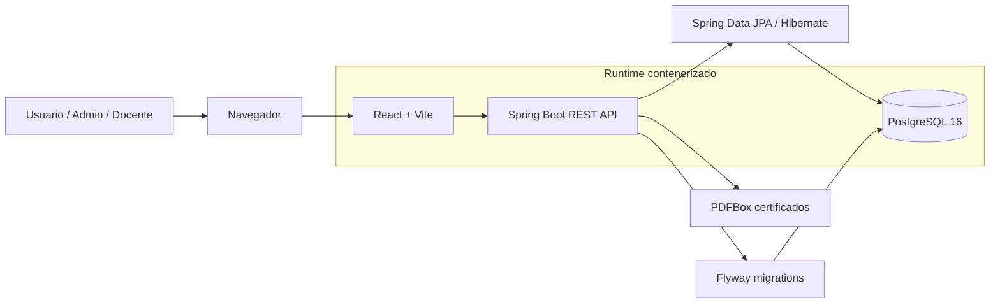
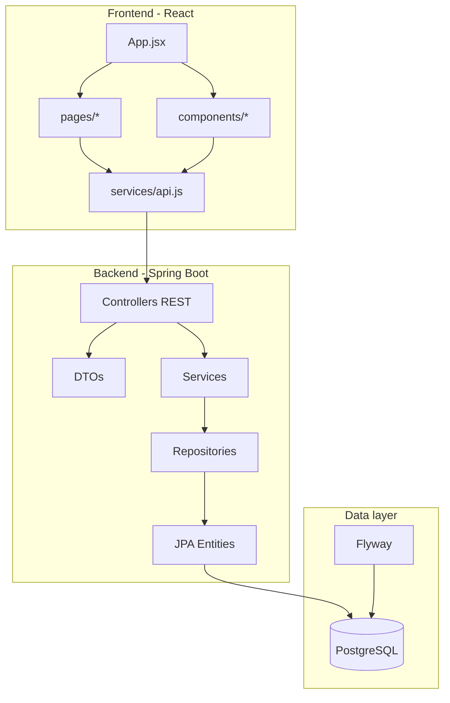
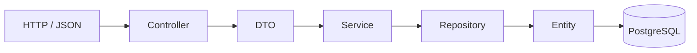
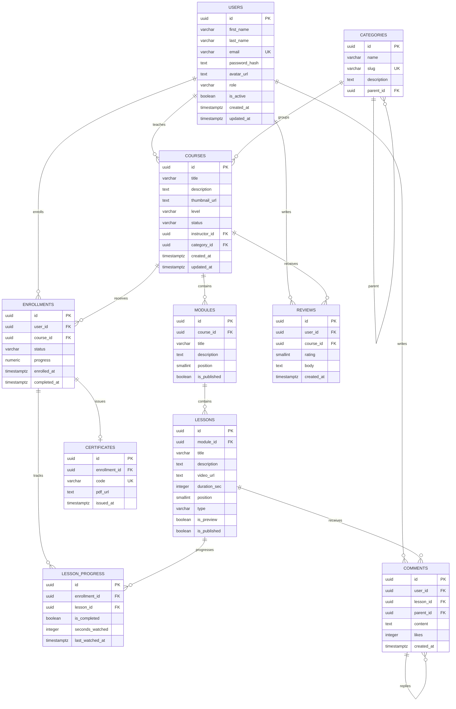
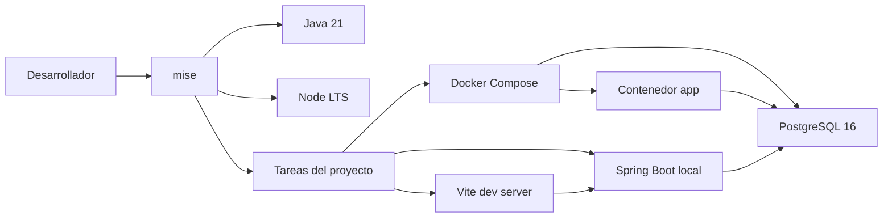
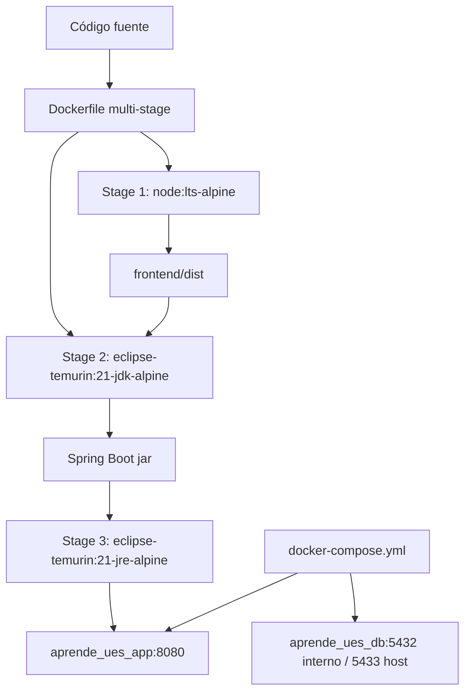

<p align="center">
  
</p>


<p align="center">
  <b>Plataforma Educativa | Universidad de El Salvador</b>
</p>

<p align="center">
  
  
  
  
  
</p>
<h1 align="center" style="color: #f4e9e9; border-bottom: none;">AprendeUES</h1>

Plataforma educativa para gestionar cursos, módulos, lecciones, progreso académico, comentarios, reseñas y certificados de finalización. El proyecto combina una experiencia web en React con una API REST en Spring Boot, persistencia en PostgreSQL y un flujo de desarrollo reproducible con mise y Docker.

---

## Integrantes

| Nombre | Carnet |
|---|---|
| Rodrigo Alexis Mercado Calidonio | MC24029 |
| Kevin Manuel Lemus Najarro | LN13002 |
| Jose Gerardo Pleites Campos | PC24020 |
| Salvador Ernesto Ventura Vasquez | VV24014 |
| Kevin Geovanni Gonzalez Salazar | GS24037 |

---

## Vista general



La aplicación puede ejecutarse en modo desarrollo local o como stack completo con Docker Compose. En el stack contenerizado, el frontend se compila y queda servido como archivos estáticos dentro del backend Spring Boot.

---

## Stack tecnológico

| Capa | Tecnología | Uso |
|---|---|---|
| Frontend | React + Vite | Interfaz web, vistas por rol, consumo de API |
| Backend | Spring Boot 3.5 + Java 21 | API REST, validación, lógica de negocio |
| Persistencia | Spring Data JPA + Hibernate | Repositorios y mapeo entidad-tabla |
| Base de datos | PostgreSQL 16 | Datos académicos y progreso |
| Migraciones | Flyway | Versionado del schema y seed data |
| Certificados | Apache PDFBox | Generación de PDF descargable |
| DX | mise | Instalación de herramientas y ejecución de tareas |
| Contenedores | Docker + Docker Compose | App completa y PostgreSQL reproducibles |

---

## Estructura de carpetas

```text
.
├── backend/
│   ├── pom.xml
│   ├── mvnw
│   └── src/
│       ├── main/
│       │   ├── java/com/aprende/ues/backend/
│       │   │   ├── config/          # OpenAPI / Swagger
│       │   │   ├── controller/      # Endpoints REST
│       │   │   ├── dto/             # Request/Response DTOs
│       │   │   ├── exceptions/      # Errores de dominio y handler REST
│       │   │   ├── model/           # Entidades JPA y enums
│       │   │   ├── repository/      # Spring Data repositories
│       │   │   └── service/         # Casos de uso y reglas de negocio
│       │   └── resources/
│       │       ├── application.properties
│       │       ├── assets/          # Recursos usados por backend, como logo UES
│       │       └── db/migration/    # Migraciones Flyway
│       └── test/                    # Pruebas de backend
├── frontend/
│   ├── package.json
│   ├── vite.config.js
│   └── src/
│       ├── components/              # Componentes reutilizables
│       ├── pages/                   # Pantallas CRUD / administración
│       ├── services/                # Cliente API y mappers DTO
│       ├── assets/                  # Imágenes estáticas
│       ├── App.jsx
│       └── main.jsx
├── docs/
│   └── mise.md
├── Dockerfile                       # Build multi-stage frontend + backend
├── docker-compose.yml               # App + PostgreSQL
├── mise.toml                        # Herramientas y tareas DX
└── README.md
```

---

## Arquitectura de la aplicación



### Capas del backend



---

## Modelo de datos



### Reglas importantes del schema

- Un usuario puede tener rol `student`, `instructor` o `admin`.
- Un curso pertenece a un instructor y opcionalmente a una categoría.
- Un curso contiene módulos; un módulo contiene lecciones.
- Una inscripción une un usuario con un curso y mantiene `progress`.
- `lesson_progress` recalcula automáticamente el progreso de la inscripción mediante trigger.
- Un certificado pertenece a una inscripción completada y tiene código único.
- Los comentarios soportan respuestas anidadas mediante `parent_id`.
- Las reseñas son únicas por usuario y curso.

---

## Cómo se conectan las herramientas



### Flujo con Docker



---

## Requisitos previos

- [mise](https://mise.jdx.dev/) para herramientas y tareas del proyecto.
- [Docker](https://www.docker.com/) para PostgreSQL y stack contenerizado.
- Git.

El proyecto define las herramientas en `mise.toml`:

```toml
[tools]
java = "temurin-21"
node = "lts"
```

---

## Configuración inicial

```bash
git clone <url-del-repositorio>
cd DAW-Plataforma-Educativa-Grupo9

mise trust
mise install
```

---

## Ejecución

### Desarrollo local

```bash
mise run dev
```

Este flujo levanta PostgreSQL con Docker, ejecuta backend y frontend en modo desarrollo y deja disponible Swagger UI para explorar la API.

### Stack completo con Docker

```bash
mise run app:up
```

Este comando construye la imagen de la aplicación, empaqueta el frontend dentro del backend y levanta:

- App web: `http://localhost:8080`
- API REST: `http://localhost:8080/api`
- Swagger UI: `http://localhost:8080/swagger-ui.html`
- PostgreSQL host: `localhost:5433`

También puedes ejecutar el stack directamente con Docker Compose:

```bash
# Compilar la imagen
docker compose build

# Iniciar la app y la base de datos
docker compose up
```

Para compilar e iniciar en un solo paso:

```bash
docker compose up --build
```

Si prefieres dejarlo corriendo en segundo plano:

```bash
docker compose up -d
```

Para ver los logs del stack:

```bash
docker compose logs -f
```

Para detener el stack:

```bash
mise run app:down
```

O directamente con Docker Compose:

```bash
docker compose down
```

---

## Tareas disponibles

| Comando | Descripción |
|---|---|
| `mise run dev` | Levanta DB, backend y frontend para desarrollo local |
| `mise run app:up` | Construye y levanta app + DB con Docker Compose |
| `mise run app:down` | Detiene el stack de Docker Compose |
| `mise run app:logs` | Muestra logs de app y base de datos |
| `mise run backend` | Ejecuta solo Spring Boot, requiere DB activa |
| `mise run db:up` | Levanta PostgreSQL en Docker |
| `mise run db:down` | Detiene y elimina los servicios de compose |
| `mise run db:logs` | Muestra logs de PostgreSQL |
| `mise run db:migrate` | Ejecuta migraciones sin levantar toda la app |
| `mise run backend:test` | Ejecuta pruebas del backend |

---

## URLs útiles

| Servicio | URL |
|---|---|
| App web contenerizada | `http://localhost:8080` |
| Frontend local Vite | `http://localhost:5173` |
| API base | `http://localhost:8080/api` |
| Swagger UI | `http://localhost:8080/swagger-ui.html` |
| Actuator health | `http://localhost:8080/actuator/health` |

---

## Base de datos

PostgreSQL corre en Docker con la siguiente configuración:

| Parámetro | Desarrollo local |
|---|---|
| Host | `localhost` |
| Puerto host | `5433` |
| Puerto contenedor | `5432` |
| Base de datos | `aprende_ues` |
| Usuario | `aprende_ues` |
| Contraseña | `aprende_ues` |

El backend usa variables de entorno con fallback:

```properties
DB_HOST=localhost
DB_PORT=5433
DB_NAME=aprende_ues
DB_USER=aprende_ues
DB_PASSWORD=aprende_ues
```

En Docker Compose, el backend se conecta a `db:5432` dentro de la red de contenedores.

---

## Migraciones Flyway

Las migraciones viven en:

```text
backend/src/main/resources/db/migration/
├── V1__initial_schema.sql
├── V2__seed_data.sql
├── V3__realistic_seed.sql
├── V4__change_role_to_varchar.sql
├── V5__create_categories_table.sql
├── V6__repair_orphan_course_categories.sql
├── V7__translate_seed_data_to_spanish.sql
├── V8__change_enrollment_status_to_varchar.sql
└── V9__add_matching_youtube_links_to_html_css_lessons.sql
```

Regla de equipo: no modificar migraciones `V` ya aplicadas. Para cambios nuevos se agrega una migración nueva:

```text
V10__descripcion_del_cambio.sql
V11__otra_mejora.sql
```

Flyway valida checksums y Spring Boot usa `spring.jpa.hibernate.ddl-auto=validate`, por lo que el schema real debe coincidir con las entidades JPA.

---

## API principal

| Recurso | Endpoint base |
|---|---|
| Usuarios | `/api/users` |
| Categorías | `/api/categories` |
| Cursos | `/api/courses` |
| Módulos | `/api/modules` |
| Lecciones | `/api/lessons` |
| Inscripciones | `/api/enrollments` |
| Progreso de lección | `/api/lesson-progress` |
| Certificados | `/api/certificates` |
| Comentarios | `/api/comments` |
| Reseñas | `/api/reviews` |

Swagger UI está disponible en:

```text
http://localhost:8080/swagger-ui.html
```

---

## Convención de commits

Este proyecto usa Conventional Commits:

```text
feat: agrega emisión de certificados
fix: corrige cálculo de progreso por inscripción
docs: actualiza README con arquitectura
chore: actualiza configuración de Docker
```
---
<div align="center">
    <kbd>© 2026 - Grupo 9 | Desarrollo de Aplicaciones Web</kbd>
</div>
